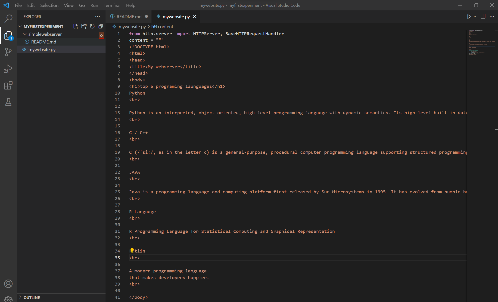
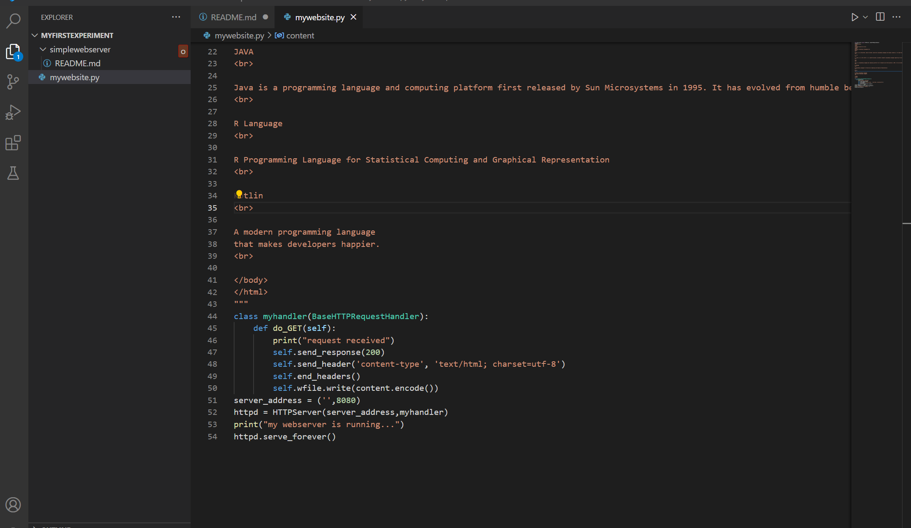
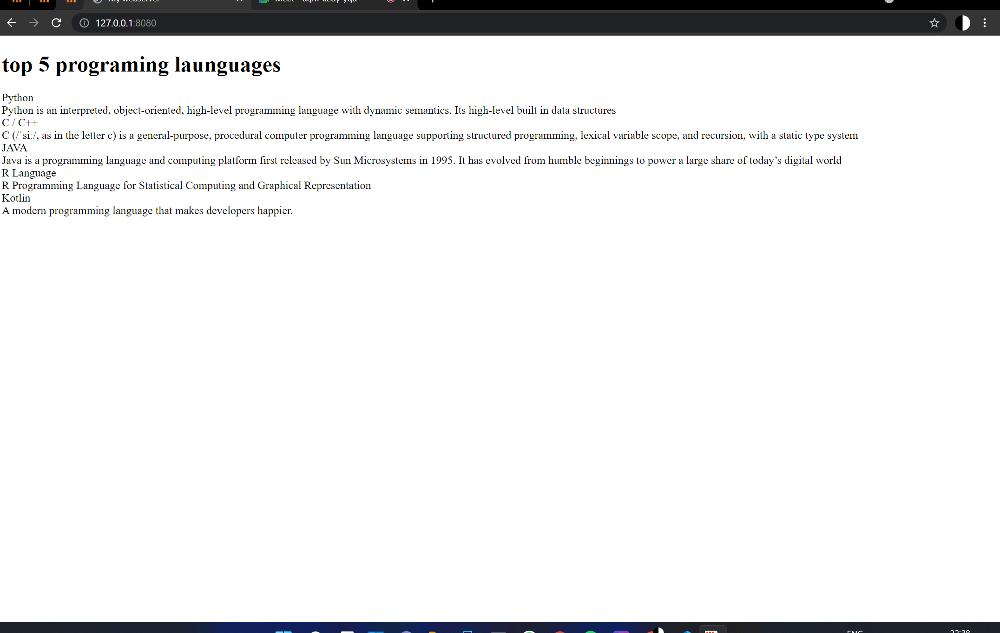

# Developing a Simple Webserver
## AIM:
To develop a simple webserver to top 5 programing launguages.

## DESIGN STEPS:
### Step 1: 
HTML content creation
### Step 2:
Design of webserver workflow
### Step 3:
Implementation using Python code
### Step 4:
Serving the HTML pages.
### Step 5:
Testing the webserver

## PROGRAM:
from http.server import HTTPServer, BaseHTTPRequestHandler
content = """
~~~
<!DOCTYPE html>
<html>
<head>
<title>My webserver</title>
</head>
<body>
<h1>top 5 programing launguages</h1>
Python
 

Python is an interpreted, object-oriented, high-level programming language with dynamic semantics. Its high-level built in data structures
 

C / C++ 
 

C (/ˈsiː/, as in the letter c) is a general-purpose, procedural computer programming language supporting structured programming, lexical variable scope, and recursion, with a static type system
 

JAVA
 

Java is a programming language and computing platform first released by Sun Microsystems in 1995. It has evolved from humble beginnings to power a large share of today’s digital world
 

R Language
 

R Programming Language for Statistical Computing and Graphical Representation
 

Kotlin
 

A modern programming language
that makes developers happier.
 

</body>
</html>
~~~
"""
~~~
class myhandler(BaseHTTPRequestHandler):
    def do_GET(self):
        print("request received")
        self.send_response(200)
        self.send_header('content-type', 'text/html; charset=utf-8')
        self.end_headers()
        self.wfile.write(content.encode())
server_address = ('',8080)
httpd = HTTPServer(server_address,myhandler)
print("my webserver is running...")
httpd.serve_forever()
~~~

~~~

def f(x):
 return x**3-x-2
def f1(x):
 return 3*x**2-1
xo=float (input ("Enter the initial approximation: "))
for i in range (1,10):
 xn=xo-f(xo)/f1(xo)
 xo=xn
print ("The approximate root using Newton-Raphson method is %.4f"%xn) 
~~~

~~~
x0=0; y0=0; z0=0
for i in range (1,10):
 x=1/4*(1-y0-z0)
 x0=x
 y=1/3*(2-x0-z0)
 y0=y
 z=1/5*(3-x0-y0)
 z0=z
print ("The approximate solution of x = %.4f, y= %.4f, z=%.4f"% (x, y,
z)) 
~~~

~~~
x= [0,1,2,4,5,6]
y= [1,14,15,5,6,19]
s=float (input ("Enter the value of x to be in: "))
sum=0
for i in range (0,6):
 prod=1
for j in range (0,6):
 if i!=j:
 prod=prod*(s-x[j])/(x[i]-x[j])
 sum=sum+prod*y[i]
print ("The functional value is %.4f"%sum) 
~~~
~~~
def f(x):
 return 1/(1+x**2)
a=float (input ("Enter the lower limit: "))
b=float (input ("Enter the upperlimit: "))
h=float (input ("Enter the step size: "))
n=int((b-a)/h)
sum=0
for i in range (1, n):
 sum=sum+f(a+i*h)
trap=h/2*(f(a)+f(b)+2*sum)
print ("The Integral value is %.5f"%trap)
~~~
~~~
def f (x, y):
 return x+y**2
x0=float (input ("Enter initial point of x: "))
y0=float (input ("Enter initial point of y: "))
h=float (input ("Enter step value h: "))
k1=h*f (x0, y0)
k2=h*f (x0+h/2, y0+k1/2)
k3=h*f (x0+h/2, y0+k2/2)
k4=h*f (x0+h, y0+k3)
y=y0+(k1+2*k2+2*k3+k4)/6
print ("The value of y using RK method is %.4f"%y)
~~~
~~~
def f (x, y):
 return x**2*(1+y)
x0=float (input ("Enter x0: "))
y0=float (input ("Enter y0: "))
x1=float (input ("Enter x1: "))
y1=float (input ("Enter y1: "))
x2=float (input ("Enter x2: "))
y2=float (input ("Enter y2: "))
x3=float (input ("Enter x3: "))
y3=float (input ("Enter y3: "))
h =0.1
y4p=y3+(h/24) *(55*f (x3, y3)-59*f (x2, y2) +37*f (x1, y1)-9*f (x0,
y0))
x4=x3+h
y4c=y3+(h/24) *(9*f (x4, y4p) +19*f (x3, y3)-5*f (x2, y2) +f (x1, y1))
print ("Approximate soln is %0.4f"%y4c) 
~~~

## OUTPUT:

## RESULT:
Thus the webserver is developed to display top 5 programming languages.
